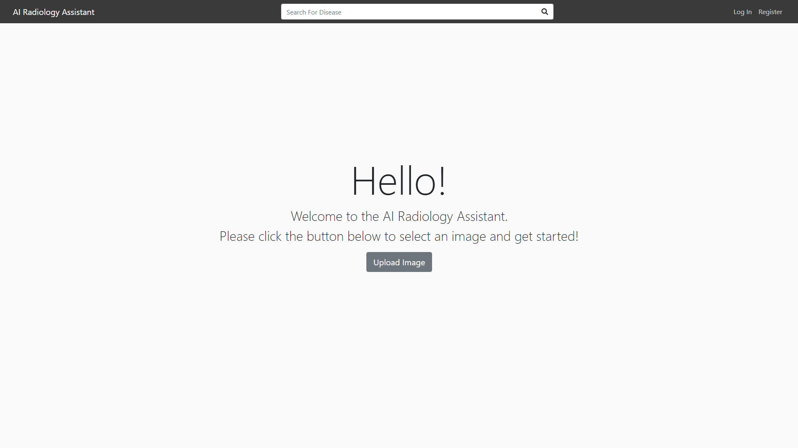

# AI-Radiology-Assistant
AI Radiology Assistant flask website.

# Introduction
This project was created in Fall 2020 for a Software Engineering class. It serves as a web app wrapper around an AI model for detecting diseases present in images of x-ray scans. Users of the application can create accounts, login, upload images for detection, fill out a medical report for said image, and search existing cases. Duplicate image uploads can be cleared out by site administrators.

# Setup
This project uses the python flask framework. All requirements needed can be found in requirements.txt. "run_local.py" will run the application using the included flask development server. "run_production.py" will use the waitress development server instead.
